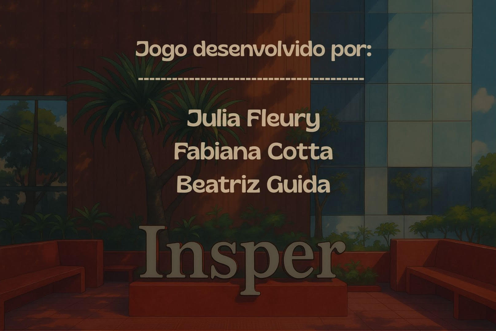

# 🐍 Fuja do Python!

**Fuja do Python!** é um jogo interativo feito com Python e Pygame, no qual você controla o mascote do Insper, uma raposa e precisa escapar dos Pythons (representados como símbolos do Python) enquanto coleta a **moeda dourada** para avançar de nível. 

Cada moeda coletada te leva para um novo nível com cada vez mais Pythons para dificultar o avanço, mas cuidado: colidir com um Python reduz suas vidas. Você começa com 5 vidas, mas quando elas acabam, acaba o jogo e você pode reiniciar ou sair! 

Aqui está um vídeo da demonstração de funcionamento do jogo: 
https://www.youtube.com/watch?v=IifzD1tzUA4

---

## 🎮 Como Jogar

- O jogo possui uma tela de início com botões clicáveis. 
- Para dar início ao jogo, basta clicar no botão **INICIAR** 
- Use as **setas do teclado** ou as teclas **W, A, S, D** para mover a raposa, sendo: 
- - **seta pra cima** e **W** movimentam o personagem para cima
- - **seta pra baixo** e **S** movimentam o personagem para baixo
- - **seta pra a direita** e **D** movimentam o personagem para a direita
- - **seta pra a esquerda** e **A** movimentam o personagem para a esquerda
- Desvie dos Pythons e **colecione a moeda dourada**.
- Se encostar em um Python, você perde uma vida.
- O jogo começa com 5 vidas e termina quando as vidas chegam a zero.
- Caso queira pausar o jogo, pressionar a tecla **P** a qualquer momento para retomar, basta apertar a tecla  **Enter**.
- Ao perder, aparece a tela de Game Over com a pontuação feita e, caso o jogador queira reiniciar, basta pressionar a tecla **Enter** ou **Return** dependendo do computador.

---

## 🧱 Estrutura do Projeto

O jogo é composto por:

- `Game` — gerencia fases, vidas, pontuação, colisões e reinício.
- `Insper` — controla o movimento da raposa.
- `Food` — representa os inimigos (Python) e a chave.
- Sistema de **menus interativos**, com botões para iniciar, sair e entrar na tela de créditos e reiniciar.
- Sons, imagens e fontes customizadas.

---

## 🖼️ Telas do Jogo

| Menu Principal | Tela de Créditos | Game Over |
|----------------|------------------|-----------|
|  |  |  |

---

## 🗂️ Requisitos

- Python 3.8+
- [Pygame](https://www.pygame.org/) (`pip install pygame`)
- Pastas obrigatórias:
  - `images/` com:
    - `insper.png`
    - `food.png`
    - `chave.png`
    - `inicio_2.jpg`
    - `tela_creditos.jpg`
    - `game_over.jpg`
  - `sounds/` com:
    - `som_pegar_moeda.mp3`
    - `som_colisao.mp3`
  - `fontes/` com:
    - `fonte_textos.TTF`
- Fonte padrão já inclusa --> SysFont

---

## ▶️ Como Rodar

1. Instale o Pygame:
   ```bash
   pip install pygame
   ```

2. Todo o código funciona em apenas um arquivo, portanto para acessar o menu para iniciar, ver créditos ou sair, além de consequentemente rodar o jogo:
   ```bash
   python PyGame.py
   ```

---

## ✨ Créditos

Desenvolvido por **Julia Fleury, Fabiana Cotta e Beatriz Guida** como projeto de programação com Pygame.

Imagens, fontes e sons utilizados são de autoria livre ou com permissão para fins educacionais.

---

## 🧩 Licença

Projeto desenvolvido para fins educacionais. Livre para uso e adaptação com créditos.
